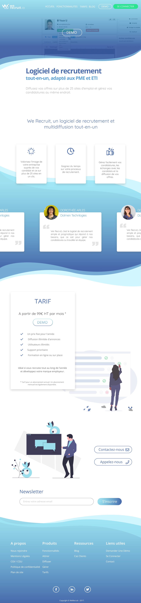

# WeRecruit-exercise
Exercice pour le stage de WeRecruit : Refonte des page de Landing et Tarifs.

## Install the repository :

To do so, you first need to have npm. Then in your terminal you can execute the command `npm install` and you should be good to go, have fun :)

If you intend to modify the scss, you can run `npm run scss` to watch, compile and minify any files in the *./assets/scss* folder.

## Mock-ups :

### Landing page

### Prices page

